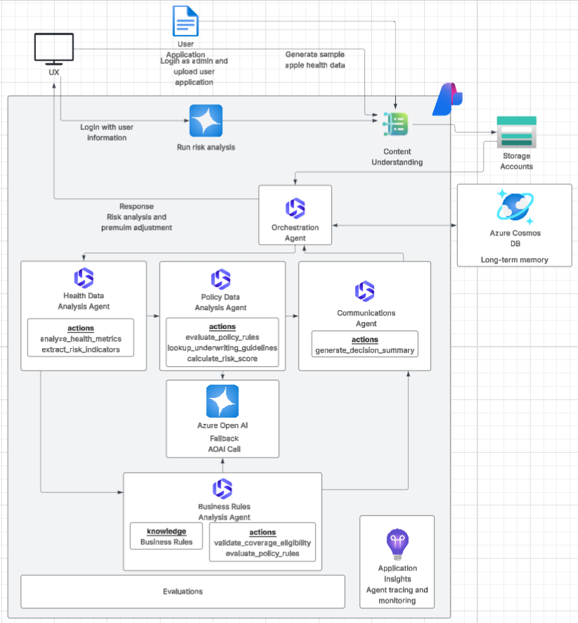
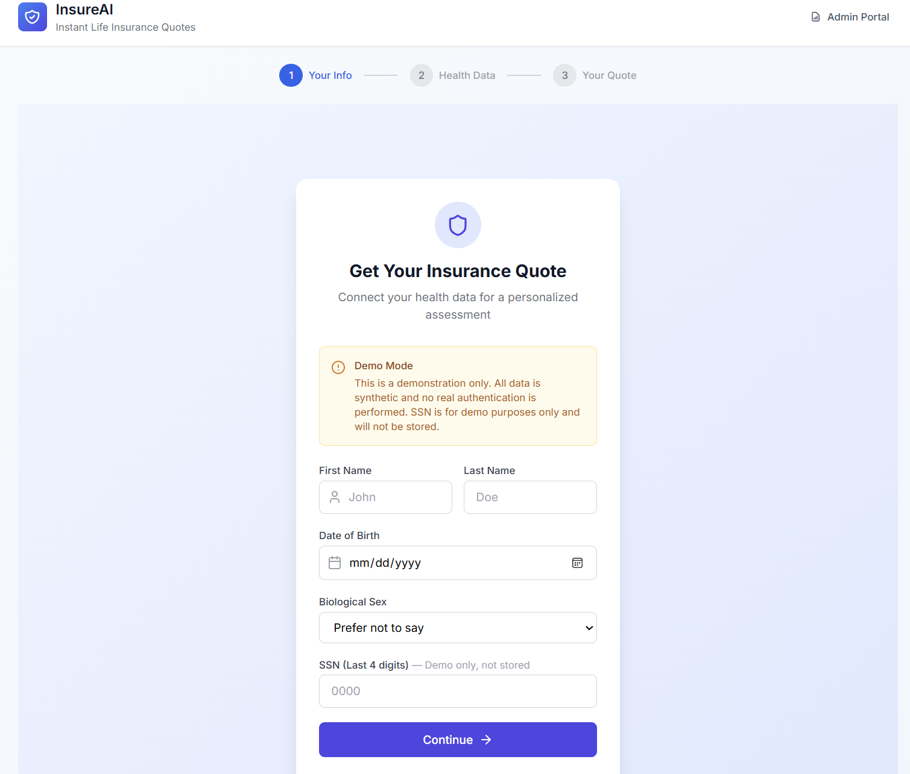
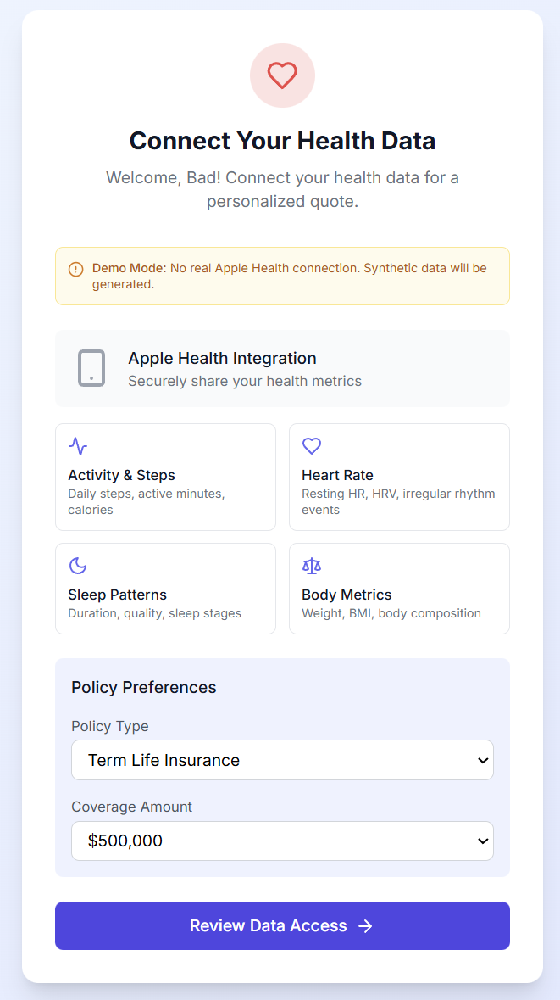
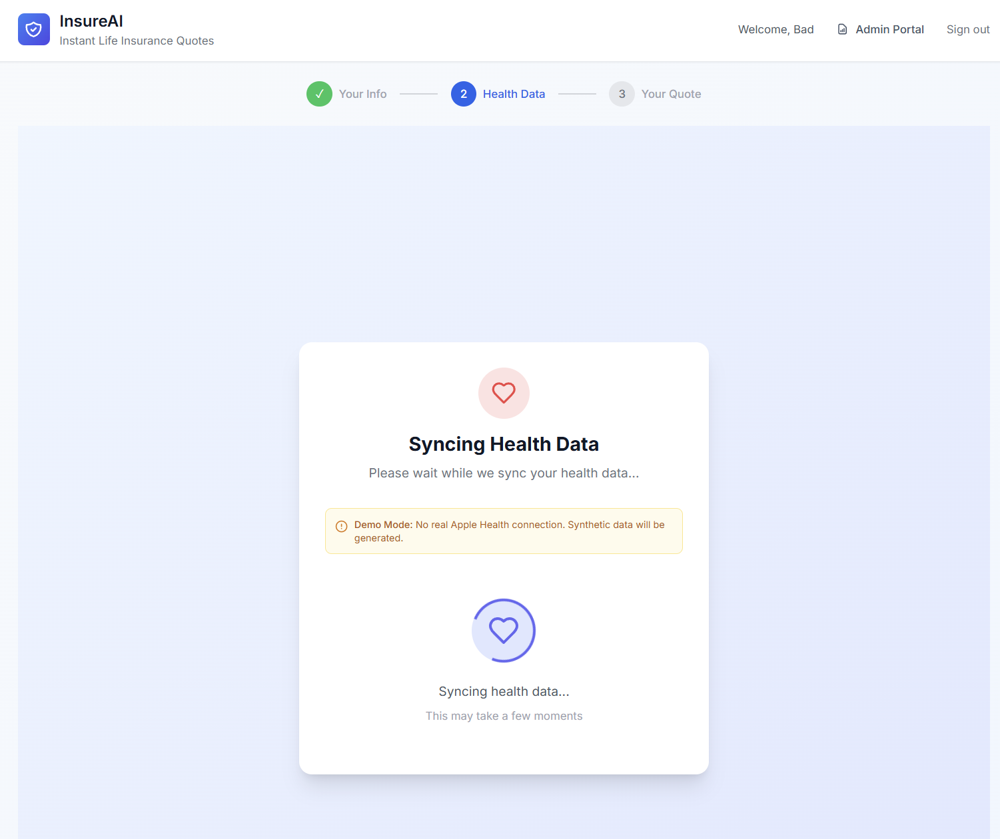
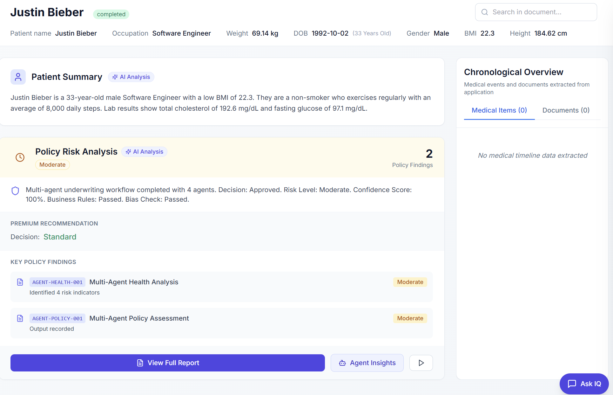
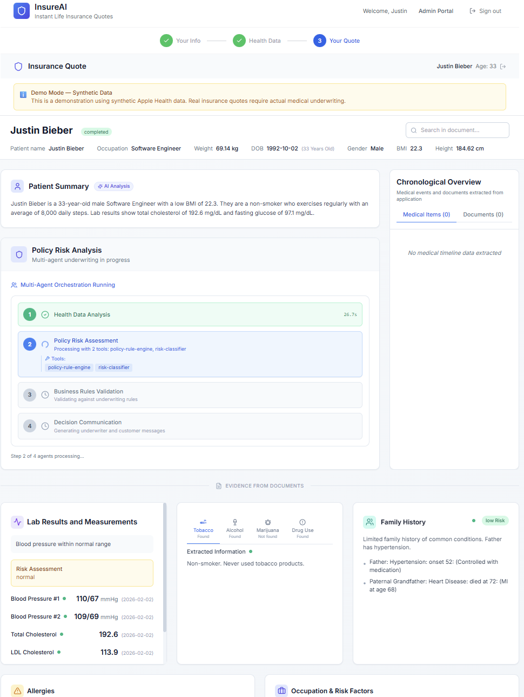
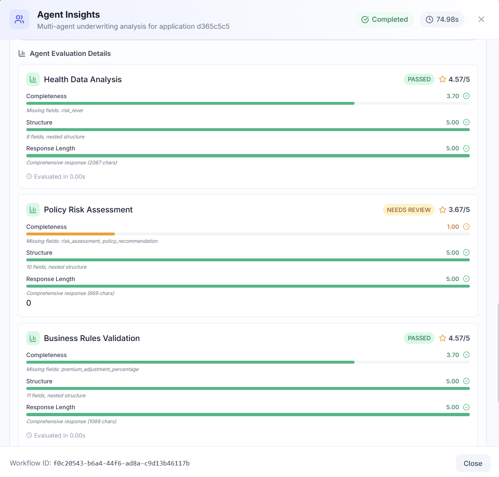
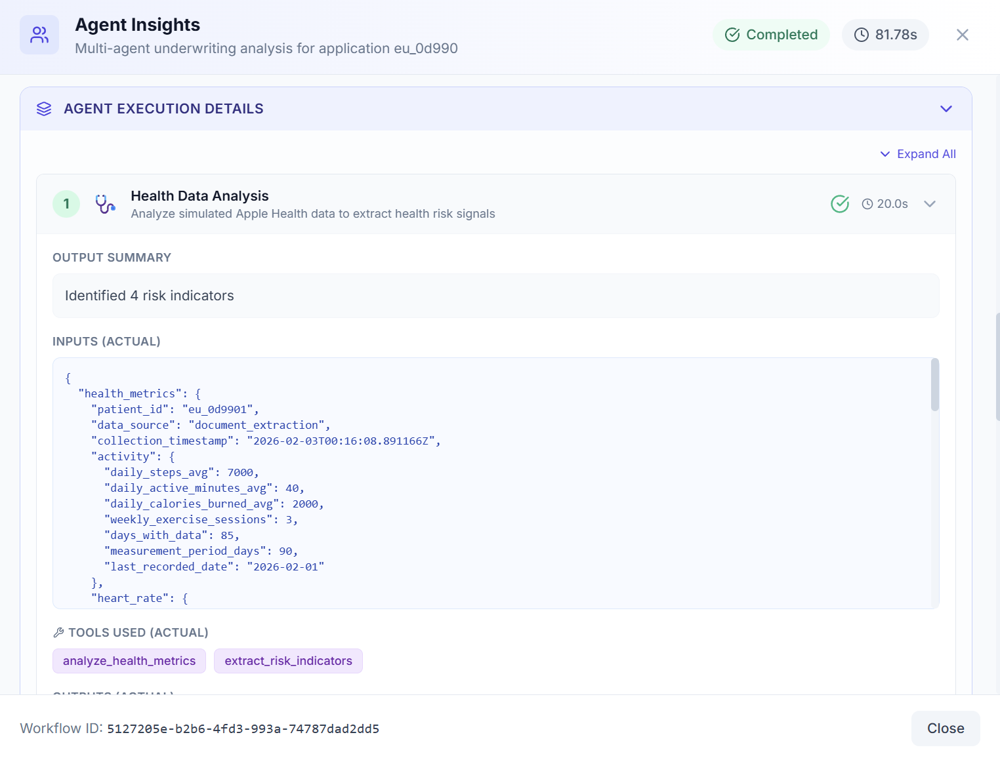
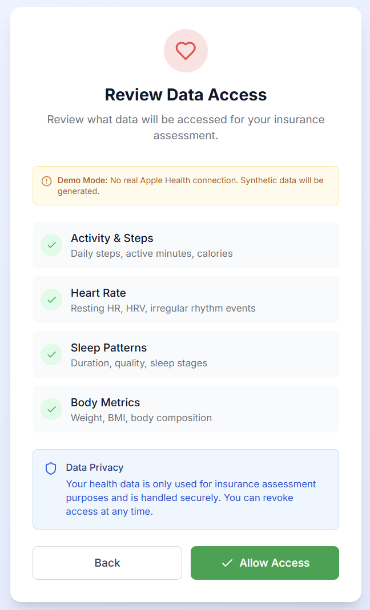

<div align="center">

# InsureAI

### AI-Powered Workbench for Insurance Underwriters, Claims Processors & End Users

[](https://www.python.org/downloads/)
[](https://nodejs.org/)
[](https://azure.microsoft.com/en-us/products/ai-studio/)
[](https://opensource.org/licenses/MIT)

**InsureAI** is a Microsoft accelerator providing a modern AI-powered workbench for **underwriters**, **claims processors**, and **end users**, combining **Azure AI Content Understanding**, **Azure AI Foundry Multi-Agent Orchestration**, and **Azure AI Evaluation SDK** to streamline document-heavy insurance workflows with full transparency and auditability.

[Business Value](#business-value) | [Architecture](#architecture) | [Features](#features) | [Quick Start](#quick-start) | [Deployment](#deployment)

</div>

---

## Business Value

InsureAI delivers measurable business impact across insurance operations:

### For Insurance Carriers

| Metric | Impact |
|--------|--------|
| **Application Processing Time** | 70-80% reduction (hours → minutes) |
| **Underwriting Consistency** | Standardized risk assessment with policy alignment |
| **Audit Compliance** | Full decision traceability with agent-level transparency |
| **Operational Costs** | Reduced manual review overhead |
| **Customer Experience** | Self-service applications with real-time status |

### Key Business Outcomes

- **Faster Time-to-Decision**: Automated document extraction and multi-agent risk analysis
- **Reduced Error Rates**: AI-powered validation against underwriting policies
- **Regulatory Compliance**: Complete audit trails with Cosmos DB persistence
- **Scalable Operations**: Handle volume spikes without proportional staffing
- **Quality Assurance**: Azure AI Foundry evaluations provide continuous quality scoring

---

## Architecture



### System Overview

```
┌─────────────────────────────────────────────────────────────────────────────┐
│                           USER INTERFACES                                    │
│  ┌─────────────────┐  ┌─────────────────┐  ┌─────────────────┐              │
│  │   Underwriter   │  │  Claims Adjuster│  │   End User      │              │
│  │   Workbench     │  │   Workbench     │  │   (Apple Health)│              │
│  └────────┬────────┘  └────────┬────────┘  └────────┬────────┘              │
│           │                    │                    │                        │
│           └────────────────────┼────────────────────┘                        │
│                                │                                             │
│                    ┌───────────▼───────────┐                                 │
│                    │    Next.js 14 UI      │                                 │
│                    │  (React + Tailwind)   │                                 │
│                    └───────────┬───────────┘                                 │
└────────────────────────────────┼─────────────────────────────────────────────┘
                                 │ REST API / SSE
┌────────────────────────────────┼────────────────────────────────────────────┐
│                    ┌───────────▼───────────┐                                │
│                    │   FastAPI Backend     │                                │
│                    │    (Python 3.10+)     │                                │
│                    └───────────┬───────────┘                                │
│                                │                                            │
│    ┌───────────────────────────┼───────────────────────────┐                │
│    │                           │                           │                │
│    ▼                           ▼                           ▼                │
│ ┌──────────────┐    ┌──────────────────┐    ┌─────────────────────┐         │
│ │   Personas   │    │  Multi-Agent     │    │   End User Flow     │         │
│ │    Engine    │    │  Orchestrator    │    │   (Apple Health)    │         │
│ └──────────────┘    └────────┬─────────┘    └─────────────────────┘         │
│                              │                                              │
│         ┌────────────────────┼────────────────────┐                         │
│         │                    │                    │                         │
│         ▼                    ▼                    ▼                         │
│  ┌─────────────┐   ┌─────────────────┐   ┌─────────────────┐                │
│  │   Health    │   │   Policy Risk   │   │  Business Rules │                │
│  │   Data      │   │     Agent       │   │   Validation    │                │
│  │   Analysis  │   │                 │   │     Agent       │                │
│  └─────────────┘   └─────────────────┘   └─────────────────┘                │
│         │                    │                    │                         │
│         └────────────────────┼────────────────────┘                         │
│                              ▼                                              │
│                    ┌─────────────────┐                                      │
│                    │  Communication  │                                      │
│                    │     Agent       │                                      │
│                    └─────────────────┘                                      │
│                              │                                              │
│                              ▼                                              │
│                    ┌─────────────────┐                                      │
│                    │ Foundry Evals   │                                      │
│                    │ (Quality Scores)│                                      │
│                    └─────────────────┘                                      │
│                                                                             │
│                         BACKEND SERVICES                                    │
└─────────────────────────────────────────────────────────────────────────────┘
                                 │
┌────────────────────────────────┼────────────────────────────────────────────┐
│                           AZURE AI SERVICES                                 │
│                                │                                            │
│    ┌───────────────────────────┼───────────────────────────┐                │
│    │                           │                           │                │
│    ▼                           ▼                           ▼                │
│ ┌──────────────┐    ┌──────────────────┐    ┌─────────────────────┐         │
│ │  Azure AI    │    │   Azure OpenAI   │    │   Azure AI Foundry  │         │
│ │   Content    │    │    Service       │    │      Agents         │         │
│ │Understanding │    │                  │    │                     │         │
│ │              │    │  • GPT-4.1       │    │  • Health Analysis  │         │
│ │• Doc Search  │    │  • Embeddings    │    │  • Risk Validation  │         │
│ │• OCR/Layout  │    │  • Chat          │    │  • Communication    │         │
│ │• Extraction  │    │                  │    │                     │         │
│ └──────────────┘    └──────────────────┘    └─────────────────────┘         │
│                                                                             │
│    ┌──────────────────────────────────────────────────────────────┐         │
│    │                    Azure AI Evaluation SDK                   │         │
│    │  • Groundedness • Coherence • Relevance • Fluency            │         │
│    └──────────────────────────────────────────────────────────────┘         │
└─────────────────────────────────────────────────────────────────────────────┘
                                 │
┌────────────────────────────────┼────────────────────────────────────────────┐
│                           DATA SERVICES                                     │
│    ┌───────────────────────────┼───────────────────────────┐                │
│    │                           │                           │                │
│    ▼                           ▼                           ▼                │
│ ┌──────────────┐    ┌──────────────────┐    ┌─────────────────────┐         │
│ │ Azure Blob   │    │   Azure Cosmos   │    │  Azure PostgreSQL   │         │
│ │   Storage    │    │      DB          │    │  (Optional RAG)     │         │
│ │              │    │                  │    │                     │         │
│ │• Documents   │    │• Agent Runs      │    │  • pgvector         │         │
│ │• PDFs        │    │• Token Tracking  │    │  • Policy Chunks    │         │
│ │• Metadata    │    │• Evaluations     │    │  • Semantic Search  │         │
│ └──────────────┘    └──────────────────┘    └─────────────────────┘         │
└─────────────────────────────────────────────────────────────────────────────┘
```

### Multi-Agent Workflow

```
┌────────────┐    ┌─────────────────┐    ┌─────────────────┐    ┌─────────────┐
│  Document  │───>│  Health Data    │───>│  Policy Risk    │───>│  Business   │
│  Upload    │    │  Analysis Agent │    │     Agent       │    │  Rules      │
└────────────┘    └─────────────────┘    └─────────────────┘    │ Validation  │
                         │                       │              └──────┬──────┘
                         │                       │                     │
                         ▼                       ▼                     ▼
                  ┌─────────────┐         ┌─────────────┐       ┌─────────────┐
                  │  Foundry    │         │  Foundry    │       │  Foundry    │
                  │  Evaluation │         │  Evaluation │       │  Evaluation │
                  └─────────────┘         └─────────────┘       └─────────────┘
                                                                       │
                                                                       ▼
                                                            ┌─────────────────┐
                                                            │  Communication  │
                                                            │     Agent       │
                                                            └────────┬────────┘
                                                                     │
                                                                     ▼
                                                            ┌─────────────────┐
                                                            │ Final Decision  │
                                                            │ + Workflow Eval │
                                                            └─────────────────┘
```

---

## Features

### Multi-Agent Underwriting Engine

- **Orchestrated Agent Workflow** - 4-agent pipeline for comprehensive risk assessment
- **Azure AI Foundry Integration** - Agents deployed as Foundry AI agents with tool calling
- **Real-time Progress Streaming** - SSE-based progress updates during agent execution
- **Agent Transparency View** - Full visibility into each agent's inputs, outputs, and reasoning
- **Azure AI Evaluations** - Quality scoring (groundedness, coherence, relevance, fluency) after each agent

### End User Self-Service Flow

- **Apple Health Integration** - Mock Apple Health data import for self-service applications
- **Applicant Portal** - End users can submit applications and track status
- **Real-time Agent Progress** - Live visualization of underwriting decision process
- **Patient Summary Display** - Health metrics, lab results, family history visualization

### Underwriter Workbench

- **Document Extraction** - Azure AI Content Understanding with field-level confidence
- **AI-Powered Analysis** - LLM prompts for comprehensive document summarization
- **Policy-Driven Risk Ratings** - Automated risk assessment with auditable policy citations
- **Ask IQ Chat** - Context-aware chat with RAG-powered policy search
- **Policy Report Modal** - Full evaluation summary with PDF export

### Claims Processing

- **Medical Claims Review** - ICD-10 code extraction and coverage verification
- **Document Triage** - Intelligent routing based on claim type and complexity
- **Provider Information** - Automatic extraction of healthcare provider details

### Technical Capabilities

- **Azure AI Foundry Evaluations** - Per-agent and workflow-level quality metrics
- **Cosmos DB Observability** - Full agent run persistence and token tracking
- **Azure Blob Storage** - Scalable document storage with Azure AD authentication
- **PostgreSQL + pgvector** - Optional RAG for semantic policy search
- **Feature Flags** - Granular control over agent execution and evaluations

---

## Application Overview

<table>
<tr>
<td width="50%">

**End User Flow**



*Self-service application flow for end users with Apple Health integration*

</td>
<td width="50%">

**Connect Health Data**



*Connect and import health data from Apple Health or other sources*

</td>
</tr>
<tr>
<td width="50%">

**Health Data Analysis**



*AI-powered health metrics analysis and visualization*

</td>
<td width="50%">

**Policy Risk Analysis**



*Policy report modal with risk evaluations and PDF export*

</td>
</tr>
<tr>
<td width="50%">

**Quote Analysis**



*Underwriting quote generation with premium calculations*

</td>
<td width="50%">

**Agent Evaluations**



*Azure AI Foundry evaluation scores for each agent in the workflow*

</td>
</tr>
<tr>
<td width="50%">

**Agent Insights**



*Detailed agent transparency view showing inputs, outputs, and reasoning*

</td>
<td width="50%">

**Admin Panel**


*Prompt management and analyzer configuration*

</td>
</tr>
<tr>
<td width="50%">

**Review & Access**



*Application review interface for underwriters*

</td>
<td width="50%">

</td>
</tr>
</table>

---

## Required Azure Resources

### Core Resources (Required)

| Resource | Purpose | SKU/Tier |
|----------|---------|----------|
| **Azure AI Content Understanding** | Document extraction, OCR, layout analysis | Standard |
| **Azure OpenAI Service** | LLM for analysis, chat, embeddings | Standard |
| **Azure Blob Storage** | Document and metadata storage | Standard LRS |
| **Azure Cosmos DB** | Agent run persistence, token tracking, evaluations | Serverless |

### AI Foundry Resources (For Multi-Agent)

| Resource | Purpose | Configuration |
|----------|---------|---------------|
| **Azure AI Foundry Project** | Agent deployment and management | Create project in AI Foundry portal |
| **Foundry Agent: HealthDataAnalysis** | Health metrics analysis | Deploy via Foundry |
| **Foundry Agent: BusinessRulesValidation** | Policy rule validation | Deploy via Foundry |
| **Foundry Agent: Communication** | Decision communication generation | Deploy via Foundry |

### Optional Resources

| Resource | Purpose | When Needed |
|----------|---------|-------------|
| **Azure PostgreSQL Flexible Server** | RAG-powered policy search | If `RAG_ENABLED=true` |
| **Azure Key Vault** | Secret management | Production deployments |
| **Azure App Service** | Hosting (alternative to local) | Cloud deployment |

### Model Deployments

| Model | Deployment Name | Purpose |
|-------|-----------------|---------|
| `gpt-4.1` or `gpt-4o` | `gpt-4.1` | Document analysis, risk assessment |
| `gpt-4.1-mini` | `gpt-4.1-mini` | Chat (cost-optimized) |
| `text-embedding-3-small` | `text-embedding-3-small` | RAG embeddings (optional) |

---

## Quick Start

### Prerequisites

- **Python 3.10+** with [uv](https://github.com/astral-sh/uv) (recommended) or pip
- **Node.js 18+** with npm
- **Azure CLI** (`az login` for Azure AD authentication)
- **Azure Subscription** with required resources provisioned

### 1. Clone & Install

```bash
# Clone the repository
git clone https://github.com/microsoft/insureai.git
cd insureai

# Install Python dependencies
uv sync

# Install frontend dependencies
cd frontend && npm install && cd ..
```

### 2. Configure Environment

Create a `.env` file in the project root:

```env
# === AZURE AI CONTENT UNDERSTANDING ===
AZURE_CONTENT_UNDERSTANDING_ENDPOINT=https://your-resource.cognitiveservices.azure.com
AZURE_CONTENT_UNDERSTANDING_USE_AZURE_AD=true

# === AZURE OPENAI ===
AZURE_OPENAI_ENDPOINT=https://your-openai.openai.azure.com
AZURE_OPENAI_API_KEY=your-api-key
AZURE_OPENAI_DEPLOYMENT_NAME=gpt-4.1
AZURE_OPENAI_CHAT_DEPLOYMENT_NAME=gpt-4.1-mini

# === STORAGE ===
STORAGE_BACKEND=azure_blob
AZURE_STORAGE_ACCOUNT_NAME=your-storage-account
AZURE_STORAGE_CONTAINER_NAME=insureai-data

# === COSMOS DB ===
AZURE_COSMOS_ENDPOINT=https://your-cosmos.documents.azure.com:443/
AZURE_COSMOS_DATABASE_NAME=underwriting-agents

# === AGENT EXECUTION ===
AGENT_EXECUTION_ENABLED=true
USE_FOUNDRY_AGENTS=true
AZURE_AI_PROJECT_ENDPOINT=https://your-project.services.ai.azure.com/api/projects/your-project

# === FOUNDRY EVALUATIONS ===
FOUNDRY_EVALUATIONS_ENABLED=true
```

### 3. Run the Application

```bash
# Terminal 1: Start API server
uv run python -m uvicorn api_server:app --reload --port 8000

# Terminal 2: Start frontend
cd frontend && npm run dev
```

### 4. Access the Application

| Service | URL |
|---------|-----|
| **Frontend** | http://localhost:3000 |
| **API** | http://localhost:8000 |
| **API Docs** | http://localhost:8000/docs |
| **End User Portal** | http://localhost:3000 (select "End User" persona) |

---

## Deployment Guide

### Development Environment Setup

1. **Provision Azure Resources**
   ```bash
   # Login to Azure
   az login
   
   # Create resource group
   az group create --name rg-insureai-dev --location eastus2
   
   # Create Azure OpenAI resource
   az cognitiveservices account create \
     --name aoai-insureai-dev \
     --resource-group rg-insureai-dev \
     --kind OpenAI \
     --sku S0 \
     --location eastus2
   
   # Create Cosmos DB account
   az cosmosdb create \
     --name cosmos-insureai-dev \
     --resource-group rg-insureai-dev \
     --locations regionName=eastus2 failoverPriority=0
   
   # Create Storage Account
   az storage account create \
     --name stinsureaidev \
     --resource-group rg-insureai-dev \
     --sku Standard_LRS
   ```

2. **Deploy OpenAI Models**
   ```bash
   # Deploy GPT-4.1
   az cognitiveservices account deployment create \
     --name aoai-insureai-dev \
     --resource-group rg-insureai-dev \
     --deployment-name gpt-4.1 \
     --model-name gpt-4.1 \
     --model-version "2024-04-01-preview" \
     --sku-capacity 10 \
     --sku-name Standard
   ```

3. **Create AI Foundry Project**
   - Navigate to [Azure AI Foundry Portal](https://ai.azure.com)
   - Create new project linked to your Azure OpenAI resource
   - Deploy agents using the agent definitions in `specs/`

4. **Configure Cosmos DB**
   ```bash
   # Create database and containers
   az cosmosdb sql database create \
     --account-name cosmos-insureai-dev \
     --resource-group rg-insureai-dev \
     --name underwriting-agents
   
   az cosmosdb sql container create \
     --account-name cosmos-insureai-dev \
     --resource-group rg-insureai-dev \
     --database-name underwriting-agents \
     --name underwriting_agent_runs \
     --partition-key-path /workflow_id
   ```

5. **Run Locally**
   ```bash
   # Ensure .env is configured with all endpoints
   uv run python -m uvicorn api_server:app --reload --port 8000
   cd frontend && npm run dev
   ```

### Production Deployment Considerations

For production deployments, consider:

- **Azure App Service** or **Azure Container Apps** for hosting
- **Azure Key Vault** for secret management
- **Azure Front Door** for global distribution and WAF
- **Azure Monitor** for observability
- **Managed Identity** for service-to-service authentication

---

## License

This project is licensed under the MIT License.

---
